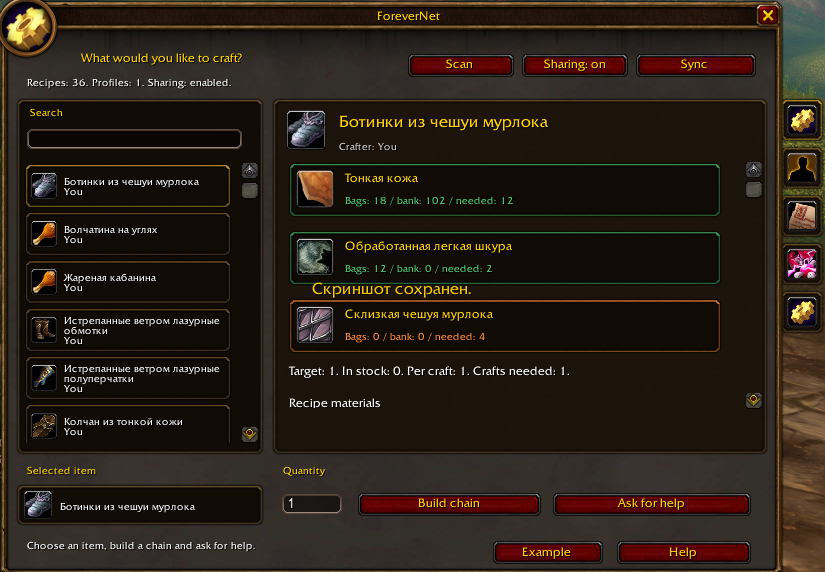
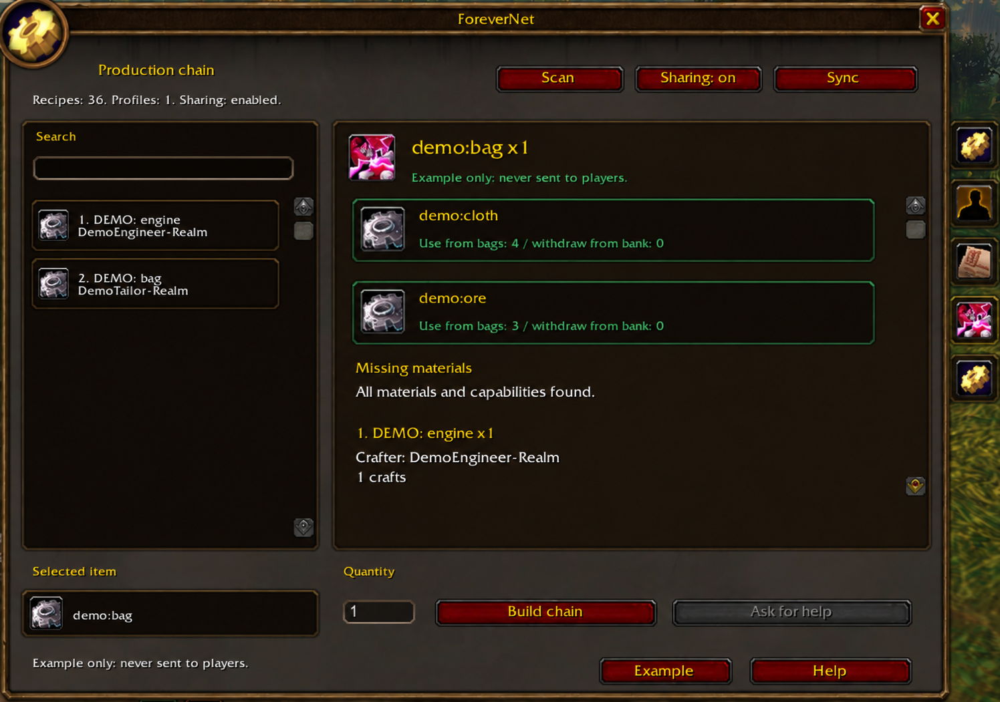
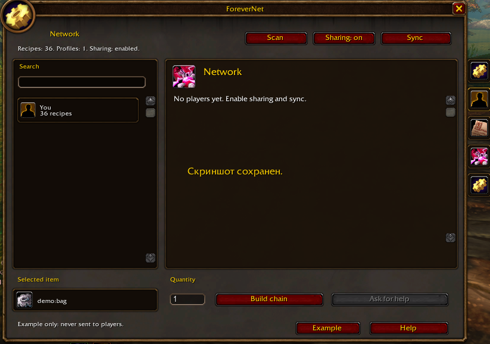
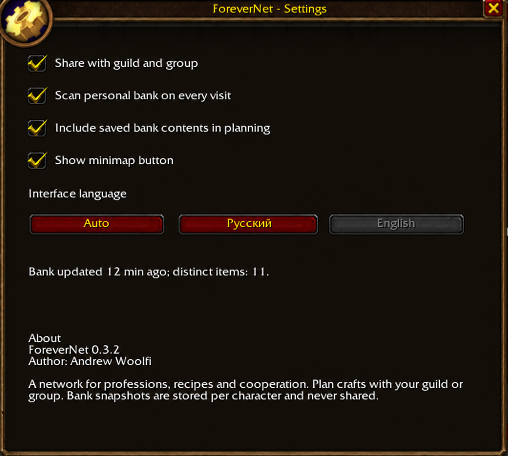

# ForeverNet

**Crafting plans and cooperation for World of Warcraft: Forever.**  
**Планирование изготовления и взаимопомощь в World of Warcraft: Forever.**

[English](#english) · [Русский](#русский)

## English

ForeverNet connects profession profiles within your guild or group. Select an item and quantity to see materials, missing components, crafting steps, and potential crafters.

**Version:** 0.3.3 · **Target client:** Forever 1.60.1 (70124), Interface 16001<br>
**Author:** Andrew Woolfi · **License:** [MIT](LICENSE)

### Features

- Searchable catalog of learned recipes scanned from your open profession; each item appears once, with a choice of crafters.
- The Network page lists other players; your own capabilities remain available for planning.
- Production chains with component quantities, crafting order, and potential crafters.
- Stock calculation using carried items and saved personal bank contents.
- Automatic personal bank snapshots on visits and inventory changes, stored per character.
- Guild/group profile sharing and item requests through in-game addon messages.
- Request lifecycle: open, accepted, completed, or cancelled; the first offer is accepted automatically by the owner's addon.
- Manual Blueprint flags and Camping facility requirements.
- Item cards, separate help sections, settings, and a movable minimap button using game textures and fonts.
- English and Russian localization, with English fallback for other client languages.

### Screenshots

**Recipe catalog and material stock**



**Production chain example**



**Guild and group network**



**Settings and addon information**



### Installation

1. Place the `ForeverNet` folder in your client's `Interface/AddOns` directory. `ForeverNet.toc` must be directly inside that folder.
2. Include all Lua files listed in the TOC and the `LICENSE` file. Development folders such as `work`, `tests`, and `docs` are not needed in game.
3. Enable ForeverNet in the AddOns list. Restart the client after the first installation; use `/reload` after updating an existing installation.

### Getting started

1. Open ForeverNet using the minimap button or `/fn`.
2. Open your own profession and click **Scan**. Clear the profession window's filters and search to include more learned recipes.
3. Select a recipe, enter a quantity, and click **Build chain**.
4. Visit your personal bank to save its contents. Withdraw required materials before crafting and rebuild the plan after stock changes.
5. To cooperate, join the same guild or group as other ForeverNet users, enable **Sharing** on both sides. Discovery starts automatically; **Sync** also refreshes profiles and requests manually.
6. Select a missing component and click **Ask for help**.

The **Example** button shows an isolated sample chain that is never published to other players.

### Controls and settings

| Control | Action |
|---|---|
| `/fn` | Open the main window |
| `/fn settings` | Open settings and addon information |
| `/fn help` | Show the command reference |
| `/fn demo` | Show a sample production chain |
| `/fn language auto` | Use the client language, with English fallback |
| `/fn language enUS` / `/fn language ruRU` | Choose a language explicitly |
| Minimap left-click | Toggle the main window |
| Minimap right-click | Open help |
| Drag the minimap button | Reposition it; the position is saved |

Settings include language, sharing, automatic network refresh (on/off, 1/2/5-minute interval), automatic bank scanning, inclusion of bank stock in plans, and minimap button visibility. The About section provides GitHub and Boosty links: click a URL and press Ctrl+C to copy it.

### Bank data and sharing

Personal bank scanning and bank stock inclusion are enabled by default. Snapshots cover purchased personal bank tabs, not account or guild banks. Outside a bank visit, plans use the last saved snapshot; its age is displayed. An unavailable or incompletely loaded tab does not replace the previous snapshot.

Sharing is disabled on first installation. Enabling it allows profession, recipe, camp, and request messages through guild or group channels. Bag and bank inventories are not shared. Automatic network refresh is enabled by default, every 2 minutes; choose 1, 2, or 5 minutes in settings. It also discovers participants on login, enabling sharing, and group/guild changes, and publishes your profile after a scan or manual recipe edit. New participants receive existing unexpired requests in that channel. Refresh waits for outgoing transfers to finish and coalesces identical profiles. Disabling automatic refresh stops initiated background synchronization; Sync still works, and enabled sharing still receives messages and answers other participants. There is no external server. Scanning your open profession remains a separate action.

Peer profiles expire after 30 minutes without an update; requests last 30 minutes. Offers use the request's original channel, so leaving that channel can prevent delivery. Disabling sharing clears outgoing messages but does not immediately erase profiles already received by others.

### Current limitations

ForeverNet is an early MVP targeting Forever. Compatibility with other WoW clients is not confirmed, although a legacy profession scanner remains in the code.

- The scanner reads the current filtered list of learned item recipes and merges it with saved recipes. Remove obsolete entries with `/fn forget RECIPE_ID` after losing a profession.
- Recipes with unsupported alternative reagents, variable costs, currency costs, or ambiguous item outputs are skipped. Optional reagents are not included in the base calculation.
- Blueprint flags and Camping requirements are entered manually. Camp availability is declared by the player, not verified in the world.
- Selecting an item pins the chosen recipe and crafter for the final item; use Change crafter / recipe to switch between available options. Intermediate components prefer the local character, then use a stable ordering. The bounded greedy planner detects shortages and cycles but can miss a workable alternative route.
- Plans do not optimize prices, travel, layers, or other players' inventory. Players craft, travel, and trade manually; a plan is not a confirmed order.
- Friends outside the supported group/guild channels, cross-faction networking, automatic whispers, material reservations, and automatic orders for every chain step are not supported.

Automated checks do not replace in-game testing. Validate bank scanning, UI scale and scrolling, and the complete request flow between real clients before relying on a release.

### Development

```text
python -m pip install -r requirements-dev.txt
python tests/run.py
```

Tests run Lua 5.1 with mocked WoW APIs. They cover module loading, scanning, planning, inventory, cycles, message validation, two-client sharing, requests, expiry, UI behavior, bank snapshots, and settings. Python and Lupa are development dependencies only.

The directed capability graph is available through `ForeverNet.SkillGraph` for development; it is not a dedicated graphical editor.

### Manual example

These `custom:*` identifiers are fictional and are added to your local profile. Keep sharing disabled while experimenting, or use `/fn demo` for an isolated example. For actual items and recipes, use valid `item:ID` and `spell:ID` identifiers.

```text
/fn profession engineering 300
/fn recipe custom:engine custom:engine 1 engineering custom:ore=3
/fn blueprint custom:engine on
/fn recipe custom:bag custom:bag 1 tailoring custom:engine=1,custom:cloth=4
/fn station custom:bag custom:workshop on
/fn camp custom:workshop 0
/fn plan custom:bag 1
```

Raw materials appear as missing in this example. Use `/fn help` for additional commands. Command names are the same in both languages. Received recipe names may retain the sender's language; local item names are used when available from the client cache.

### Support

If you would like to support development: [Andrew Woolfi on Boosty](https://boosty.to/andrewwoolfi).

### Documentation and license

- [Architecture and protocol — Russian](docs/ARCHITECTURE.md)

**MIT License. Copyright (c) 2026 Andrew Woolfi.** See [LICENSE](LICENSE) for the full terms. Include the license with distributed copies.

---

## Русский

ForeverNet объединяет профили профессий участников гильдии или группы. Выберите предмет и количество — аддон покажет материалы, недостающие компоненты, этапы изготовления и возможных исполнителей.

**Версия:** 0.3.3 · **Целевой клиент:** Forever 1.60.1 (70124), Interface 16001<br>
**Автор:** Andrew Woolfi · **Лицензия:** [MIT](LICENSE)

### Возможности

- Каталог изученных рецептов с поиском и сканированием открытой профессии: один предмет — одна строка, с выбором мастера.
- В разделе «Сеть» отображаются другие игроки; ваши возможности продолжают учитываться в расчётах.
- Производственные цепочки с количеством компонентов, порядком изготовления и возможными исполнителями.
- Расчёт запасов с учётом предметов при персонаже и сохранённого личного банка.
- Автосканирование личного банка при посещении и изменении содержимого; отдельные снимки для каждого персонажа.
- Обмен профилями и запросами через игровые каналы гильдии или группы.
- Заявки: открыта, принята, завершена или отменена; первый отклик автоматически принимает аддон автора заявки.
- Ручные метки Blueprint и требования к объектам Camping.
- Карточки предметов, справка по шагам, настройки и перемещаемая кнопка миникарты с игровыми текстурами и шрифтами.
- Русская и английская локализация; для остальных языков клиента используется английский.

### Скриншоты

**Каталог рецептов и запасы материалов**


**Пример производственной цепочки**


**Сеть гильдии и группы**


**Настройки и информация об аддоне**


### Установка

1. Поместите папку `ForeverNet` в каталог `Interface/AddOns` вашего клиента. Файл `ForeverNet.toc` должен находиться непосредственно внутри этой папки.
2. Включите все Lua-файлы из TOC и файл `LICENSE`. Папки разработки `work`, `tests` и `docs` для игры не нужны.
3. Включите ForeverNet в списке модификаций. После первой установки перезапустите клиент; после обновления существующей установки выполните `/reload`.

### Начало работы

1. Откройте ForeverNet кнопкой у миникарты или командой `/fn`.
2. Откройте свою профессию и нажмите **«Сканировать»**. Очистите фильтры и поиск окна профессии, чтобы включить больше изученных рецептов.
3. Выберите рецепт, укажите количество и нажмите **«Собрать цепочку»**.
4. Посетите личный банк, чтобы сохранить содержимое. Перед изготовлением заберите нужные материалы и пересчитайте цепочку после изменения запасов.
5. Для совместной работы вступите в одну гильдию или группу с другими пользователями ForeverNet, включите **«Обмен»** у обоих. Поиск участников запускается автоматически; **«Обновить»** также позволяет вручную обновить профили и запросы.
6. Выберите недостающий компонент и нажмите **«Запросить помощь»**.

Кнопка **«Пример»** показывает изолированную учебную цепочку, которая не публикуется другим игрокам.

### Управление и настройки

| Действие | Назначение |
|---|---|
| `/fn` | Открыть главное окно |
| `/fn settings` | Открыть настройки и информацию об аддоне |
| `/fn help` | Справка по командам |
| `/fn demo` | Учебная производственная цепочка |
| `/fn language auto` | Язык клиента с английским резервным вариантом |
| `/fn language enUS` / `/fn language ruRU` | Выбрать язык вручную |
| Левый клик по кнопке миникарты | Открыть или закрыть главное окно |
| Правый клик по кнопке миникарты | Открыть справку |
| Перетаскивание кнопки миникарты | Изменить положение; оно сохраняется |

В настройках доступны язык, обмен, автообновление сети (вкл./выкл. и интервал 1/2/5 минут), автосканирование банка, учёт банковских запасов и видимость кнопки миникарты. В разделе об аддоне есть ссылки на GitHub и Boosty: нажмите на адрес и скопируйте его через Ctrl+C.

### Банк и обмен данными

Автосканирование и учёт банка включены по умолчанию. Снимки охватывают купленные вкладки личного банка; банк аккаунта и гильдии не сканируется. Вне посещения банка используются последние сохранённые данные, возраст которых отображается в интерфейсе. Недоступная или не полностью загруженная вкладка не заменяет предыдущий снимок.

Обмен выключен при первой установке. После включения через каналы гильдии или группы передаются профессии, рецепты, лагерные возможности и запросы. Содержимое сумок и банка не передаётся. Автообновление сети включено по умолчанию раз в 2 минуты; в настройках доступны интервалы 1, 2 и 5 минут. Оно также находит участников при входе, включении обмена и изменении группы/гильдии и отправляет профиль после сканирования или ручного изменения рецептов. Новые участники получают существующие неистёкшие запросы этого канала. Обновление ждёт окончания текущей отправки; одинаковые профили не дублируются в очереди. Выключение автообновления прекращает самостоятельные фоновые синхронизации; кнопка «Обновить», приём сообщений и ответы участникам при включённом обмене продолжают работать. Внешнего сервера нет. Сканирование открытой профессии остаётся отдельным действием.

Профили других игроков удаляются через 30 минут без обновления; заявки действуют 30 минут. Отклики идут по исходному каналу запроса, поэтому выход из него может помешать доставке. Отключение обмена очищает очередь отправки, но не удаляет немедленно профили, уже полученные другими игроками.

### Текущие ограничения

ForeverNet — ранний MVP для Forever. Совместимость с другими клиентами WoW не подтверждена, хотя в коде сохранён старый адаптер профессий.

- Сканер читает текущий отфильтрованный список изученных предметных рецептов и объединяет его с сохранёнными. После утраты профессии удаляйте устаревшие записи командой `/fn forget RECIPE_ID`.
- Рецепты с неподдерживаемыми альтернативными реагентами, переменной стоимостью, валютой или неоднозначным предметным результатом пропускаются. Необязательные реагенты в базовый расчёт не входят.
- Метки Blueprint и требования Camping вводятся вручную. Доступность лагеря заявляется игроком и не проверяется в игровом мире.
- Выбор рецепта закрепляет исполнителя конечного предмета. Для промежуточных компонентов приоритет имеет ваш персонаж, затем используется стабильный порядок. Ограниченный жадный алгоритм обнаруживает дефицит и циклы, но может пропустить подходящий альтернативный маршрут.
- Расчёт не оптимизирует цены, перемещение, слои мира и запасы других игроков. Изготовление, перемещение и торговля выполняются вручную; план не является подтверждённым заказом.
- Друзья вне поддерживаемых каналов группы/гильдии, межфракционная сеть, автоматические личные сообщения, резервирование материалов и автоматические заявки на каждый этап не поддерживаются.

Автоматические проверки не заменяют проверку в игре. Перед использованием выпуска проверьте сканирование банка, масштаб и прокрутку окон, а также полный цикл заявки между реальными клиентами.

### Разработка

```text
python -m pip install -r requirements-dev.txt
python tests/run.py
```

Тесты выполняют Lua 5.1 с заглушками WoW API. Они проверяют загрузку модулей, сканирование, цепочки, запасы, циклы, валидацию сообщений, обмен двух клиентов, заявки, истечение данных, интерфейс, снимки банка и настройки. Python и Lupa нужны только для разработки.

Направленный граф возможностей доступен разработчикам через `ForeverNet.SkillGraph`; отдельного графического редактора для него нет.

### Ручной пример

Идентификаторы `custom:*` вымышлены и добавляются в ваш локальный профиль. Оставьте обмен выключенным на время эксперимента либо используйте `/fn demo` для изолированного примера. Для реальных предметов и рецептов нужны действительные идентификаторы `item:ID` и `spell:ID`.

```text
/fn profession engineering 300
/fn recipe custom:engine custom:engine 1 engineering custom:ore=3
/fn blueprint custom:engine on
/fn recipe custom:bag custom:bag 1 tailoring custom:engine=1,custom:cloth=4
/fn station custom:bag custom:workshop on
/fn camp custom:workshop 0
/fn plan custom:bag 1
```

В этом примере сырьё отображается как недостающее. Дополнительные команды доступны через `/fn help`. Их имена одинаковы на обоих языках. Названия полученных рецептов могут сохранять язык отправителя; локальные названия предметов используются при наличии в кэше клиента.

### Поддержка

Поддержать разработку: [Andrew Woolfi на Boosty](https://boosty.to/andrewwoolfi).

### Документация и лицензия

- [Архитектура и протокол](docs/ARCHITECTURE.md)

**MIT License. Copyright (c) 2026 Andrew Woolfi.** Полный текст находится в [LICENSE](LICENSE). Включайте лицензию в распространяемые копии.
