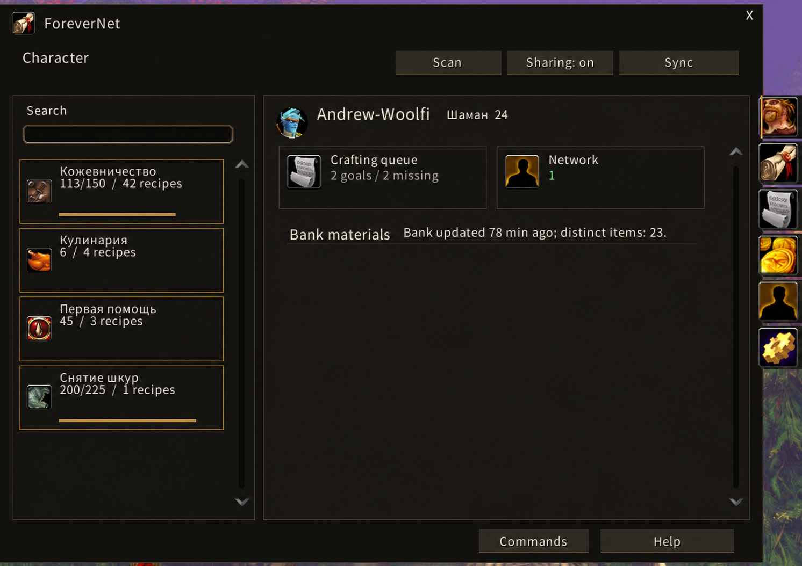
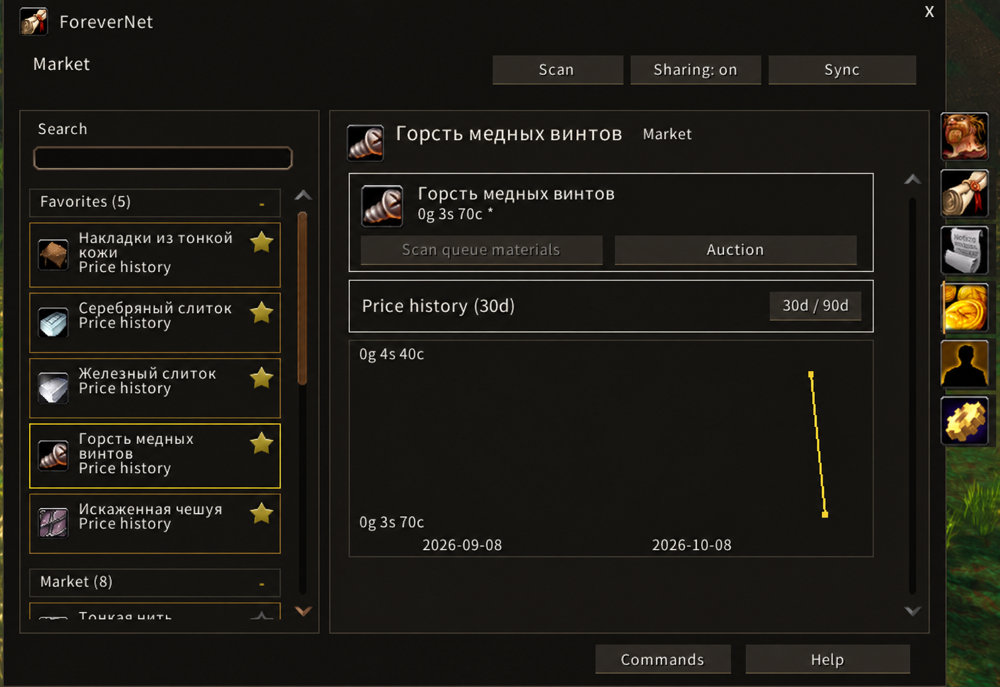

# ForeverNet

[English](#english) · [Русский](#русский)

## English

**1.1.0 Release** · Forever 1.60.1 (70124), Interface 16001

[Download](https://github.com/thewoolfi/ForeverNet/releases/tag/v1.1.0) · [Support Andrew Woolfi](https://boosty.to/andrewwoolfi)

ForeverNet connects your profession recipes with crafters in your guild or home group. Build a plan for one item or a shared queue, account for carried materials and your saved personal bank, and request help for missing components.

### Features

[Changes since 1.0.0](docs/RELEASE-1.1.0.md)

- Character overview with professions, rank/max skill and progress only in the left sidebar; queue/network state and saved-bank status on the right. Profession rows open filtered recipes.
- Recipe catalog grouped by profession, search and combined filters. One item row retains all known recipe/crafter variants; your character never appears as a duplicate network member.
- Other players' profiles grouped by profession. Favorite up to 5 profiles, 5 recipe items and 5 independent market-watch items; favorites appear first and are saved between sessions.
- Production chains with quantities, batch surplus and shared stock. Choose to obtain an intermediate material separately, craft it with a known recipe or restore automatic source selection.
- Per-character queue of up to 50 goals, editing/reordering and a movable material tracker. Save up to 10 goal sets, preview before loading, and undo the last successful load or cleanup.
- Maintained stock targets recalculate after use. Goals, sets and source choices persist; finished stock may remain in the saved bank.
- Native profession panel with finished-item quantity, Add to queue, Materials and Find a crafter. Crafter search also supports unlearned recipes with a supported item output; it does not send messages or add them to your own profile.
- ForeverNet auction-house tab for targeted material scans, observed unit/shortage prices, market volume and daily price history with 30/90-day views. Auction buttons open native name search; buying remains manual.
- Source comparisons recalculate additional purchases for the entire plan, including shared stock and batch surplus. Automatic source selection uses eligible known purchase costs while preserving explicit choices; unknown/stale prices, volume gaps and unknown crafting fees do not drive it. This is a bounded comparison, not a global economic optimizer.
- Private snapshots of purchased personal-bank tabs. Carried/bank quantities remain visible; unavailable tabs retain their last snapshot. Account/guild banks are excluded.
- Guild/home-group requests and offers, manual Sync and optional automatic refresh every 1/2/5 minutes. Queued profiles are coalesced; short interruptions preserve progress and send-rate limits retain queued messages with automatic retry.
- Switch Modern / Classic in Settings. Modern uses flat dark surfaces, bundled Sans typography and compact icon navigation; Classic restores native portrait borders, red buttons, side-tab art and game fonts. The saved choice applies immediately. Translated buttons wrap with measured height and surrounding spacing. The queue shows goals once on the left and shared material cards or crafting order on the right; selected-goal quantity autosaves. Sets/cleanup/undo live in one scrolling menu, and material cards open source comparisons. Native scrollbars remain. All 12 WoW locale codes, a language selector and bundled CJK fonts for Korean and Chinese even on a different client locale.

Recipe chat-link buttons have been extracted from ForeverNet. They belong to the separately prepared **ForeverLink**, which is not included in this repository or release. Blizzard's existing profession-share control remains available.

### Getting started

1. Extract the release ZIP into `Interface/AddOns`, so the file is `Interface/AddOns/ForeverNet/ForeverNet.toc`. Enable the addon and restart the client after first installing its fonts.
2. Open `/fn` or use the minimap button. Open your own profession and click Scan; repeat for your professions. Clear native filters if you want a broader scan.
3. Visit your personal bank to save its stock. Select a recipe/quantity and build a chain, or add goals to the queue.
4. Review the required materials and source choices. Withdraw bank materials needed for crafting; craft, travel and trade manually.
5. For cooperation, enable Sharing on both sides in a common guild/home group. Sync manually or keep automatic refresh enabled. Select a missing component to request help.

### Controls and data

`/fn` opens ForeverNet; `/fn settings`, `/fn help`, `/fn updates` and `/fn track` open the respective windows. The Commands button (or `/fn help`) opens the command reference; Help keeps the short walkthrough. Startup shows the installed version; a newer version reported by another player is saved and reminded on later logins. Left-click the minimap button to toggle the window, right-click for help. Star buttons toggle favorite recipes, profiles and market items. Market favorites have their own top sidebar group and remain available without price history; an auction scan with no shortages includes favorite recipes and market-watch items.

Settings control sharing, automatic refresh and its interval, bank scan/use, minimap visibility, interface style/language and participant-version notices. Recipe scanning on profession open and automatic purchase-cost source selection are enabled by default and can be switched off. Scanning reads your current native filters and merges recipes without deleting older entries; the open plan recalculates after inventory/profile/price changes, keeping manual choices. The update window compares versions reported by players and offers a download link. A separate built-in channel announces only the addon version in guild/home/instance groups, even with profession sharing disabled; no recipes or bank data are sent by this check. A higher reported version is saved and reminded once per session on later logins. It does not certify the latest published release or make HTTP requests. No external program or launch shortcut is needed; CurseForge installation remains in its own app.

Sharing is off on first install. Profession capabilities, recipes, camping capabilities and requests use the client's guild/home-group channels; there is no external server. Bag/bank stock, queues, sets, prices and diagnostic records stay private. Nonfavorite peer profiles expire after 30 minutes without refresh; favorites are retained and marked stale. Requests expire after 30 minutes. Local recipes, bank snapshots and favorites are saved across normal logout/reload.

Use `/fn netstatus` for transfer result, pending fragments, rate-limit state and retry timing. To investigate a protected-action popup, `/fn taint status` shows captured events; `/fn taint on` enables native logging and `/fn taint off` restores its previous setting.

### Limits

Targeted at Forever 1.60.1 (70124), Interface 16001. Other WoW clients and UI replacements are not validated. Release status does not establish every client integration as verified: auction/native layout needs further in-game coverage, and the reported protected item-use popup after visiting a bank is still under investigation.

The scanner reads learned item recipes currently visible through native filters. Ambiguous outputs, currency/variable costs and unsupported optional reagent cases may be skipped. Cached recipe/profile/bank/price data can be stale. The planner is bounded and greedy, not a global optimizer; it cannot guarantee a crafter's availability or fee. Equipment variants are not priced. Price history contains observed scans, not continuous market data. The addon neither buys items nor crafts automatically. Client-imposed messaging restrictions can pause sharing; API acceptance is not an acknowledgement from the receiver.

### Screenshots

### Development and license

Python 3 with `requirements-dev.txt`: `python tests/run.py`. Tests use Lua 5.1 mocks and include the two-client transport fixtures in `tests/network_transport.py` and `tests/forever_transport.py`. See [architecture](docs/ARCHITECTURE.md) and [localization](docs/LOCALIZATION.md). Runtime packages contain TOC/Lua, the MIT license and required font files; private work notes, developer tests and screenshots are excluded.

Code: [MIT](LICENSE), Copyright 2026 Andrew Woolfi. Bundled Noto Sans CJK derivatives: [SIL OFL 1.1](Fonts/OFL.txt), [provenance](Fonts/README.md).

## Русский

**1.1.0 Release** · Forever 1.60.1 (70124), Interface 16001

[Скачать](https://github.com/thewoolfi/ForeverNet/releases/tag/v1.1.0) · [Поддержать Andrew Woolfi](https://boosty.to/andrewwoolfi)

ForeverNet объединяет ваши рецепты с возможностями мастеров гильдии или обычной группы. Рассчитывайте одну вещь или общую очередь, учитывайте сумки и сохранённый личный банк, запрашивайте помощь с недостающими компонентами.

### Возможности

- Профессии на главной только слева: ранг/максимум, полосы навыка, давность сканирования и переход к отфильтрованным рецептам. Справа — состояние очереди, сети и сохранённого банка.
- Каталог по профессиям, поиск и совместимые фильтры. Один предмет занимает одну строку со всеми известными вариантами рецепта/мастера; свой персонаж не дублируется в сети.
- Профили других игроков с группировкой по профессиям. До 5 избранных профилей, 5 рецептов и 5 отдельных вещей рынка, сохранение отметок и размещение сверху.
- Цепочки изготовления с партиями, остатками и общими запасами. Для промежуточного материала можно выбрать получение отдельно, конкретный рецепт или автовыбор источника.
- Личная очередь до 50 целей: количество, порядок, удаление и подвижный трекер материалов. До 10 наборов с просмотром перед загрузкой и отменой последней успешной загрузки/очистки.
- Постоянные цели запаса пересчитываются после расходования. Цели, наборы и источники сохраняются; готовый запас может оставаться в сохранённом банке.
- Панель в штатном окне профессии: количество готовых вещей, добавление в очередь, материалы и поиск мастера. Поиск поддерживает неизученные рецепты с распознаваемым результатом, не отправляет сообщения и не добавляет их в личный профиль.
- Вкладка ForeverNet на аукционе: сканирование материалов, наблюдавшиеся цены за штуку/дефицит, объём лотов и история дневных цен на 30/90 дней. Кнопки аукциона запускают штатный поиск по названию; покупка ручная.
- Сравнение источников пересчитывает дополнительные покупки всего плана с общими запасами и остатками партий. Автовыбор использует пригодные известные цены и сохраняет ручные решения. Неизвестные/устаревшие цены, нехватка лотов и неизвестная плата мастеру не определяют автоподбор; сравнение ограничено и не гарантирует глобальный экономический оптимум.
- Частные снимки купленных вкладок личного банка. Видны сумки/банк; недоступная вкладка сохраняет предыдущий снимок. Банк аккаунта и гильдии не учитывается.
- Запросы и отклики в гильдии/обычной группе, ручное обновление и автоинтервалы 1/2/5 минут. Одинаковые ожидающие профили объединяются, короткая пауза сохраняет прогресс, лимит частоты не удаляет очередь.
- Переключение «Современный / Классический» в настройках с сохранением и применением сразу. Классический стиль возвращает штатные рамки, красные кнопки, оформление боковых вкладок и игровые шрифты; современные компактные разделы сохраняются. Переведённые кнопки измеряются и переносят текст с адаптацией соседних отступов. Плоский тёмный интерфейс: Sans-шрифт, светлые заголовки, спокойные акценты и компактная навигация. В очереди цели показаны один раз слева; справа общие материалы или порядок изготовления. Количество выбранной цели сохраняется сразу. Наборы/очистка/отмена доступны из одного меню, сравнение источников открывается нажатием на материал. Штатные полосы прокрутки сохранены. Все 12 кодов локалей WoW, выбор языка и встроенные CJK-шрифты для корейского/китайского на клиенте другой локали.

Кнопки ссылок рецептов вынесены из ForeverNet в отдельно подготовленный **ForeverLink**. Он не входит в этот репозиторий или выпуск. Штатная кнопка ссылки на профессию остаётся доступной.

### Начало работы

1. Распакуйте ZIP выпуска в `Interface/AddOns`: файл должен находиться по пути `Interface/AddOns/ForeverNet/ForeverNet.toc`. Включите аддон; после первой установки шрифтов перезапустите клиент.
2. Откройте `/fn` или кнопку миникарты. Откройте свою профессию и нажмите «Сканировать», повторите для остальных. Для более полного сканирования снимите штатные фильтры.
3. Посетите личный банк. Выберите рецепт/количество и постройте цепочку либо добавьте цели в очередь.
4. Проверьте материалы и способы получения. Заберите банковские реагенты, нужные для изготовления. Крафт, перемещение и обмен выполняйте вручную.
5. Для совместной работы включите «Обмен» у обоих участников общей гильдии/обычной группы. Обновляйте вручную или автоматически. Выберите недостающий компонент, чтобы запросить помощь.

### Управление и данные

`/fn` открывает ForeverNet; `/fn settings`, `/fn help`, `/fn updates`, `/fn track` — соответствующие окна. Кнопка «Команды» (или `/fn help`) открывает список команд; «Справка» сохраняет короткое руководство. При загрузке показывается установленная версия; более новая версия от другого игрока сохраняется и напоминается при следующих входах. Левый клик миникарты открывает окно, правый — справку. Звёздочки переключают избранные рецепты, профили и вещи рынка. Избранное рынка — отдельная группа сверху слева; вещи остаются доступны без истории цен. При пустом дефиците сканирование аукциона включает избранные рецепты и вещи рынка.

В настройках: обмен, автообновление и интервал, сканирование/учёт банка, миникарта, стиль/язык и сообщения проверки версии. Автосканирование при открытии профессии и автовыбор стоимости покупки включены по умолчанию и отключаются отдельно. Сканирование читает текущие штатные фильтры и добавляет рецепты без удаления прежних; открытый план пересчитывается при изменениях запасов, профилей и цен, сохраняя ручные решения. Окно обновлений сравнивает версии от игроков и даёт ссылку скачивания. Отдельный встроенный канал передаёт только номер версии в гильдии/обычной или инстансной группе, даже при выключенном обмене профессиями; рецепты и банк этой проверкой не отправляются. Более новая сообщённая версия сохраняется и напоминается при следующих входах один раз за сеанс. Это не подтверждение последнего опубликованного релиза и не HTTP-запрос. Внешняя программа или особый ярлык не нужны; установка CurseForge остаётся в его приложении.

При первой установке обмен выключен. Профессии, рецепты, лагерные возможности и запросы передаются через каналы клиента; внешнего сервера нет. Сумки/банк, очереди, наборы, цены и диагностика остаются личными. Обычные профили удаляются через 30 минут без обновления; избранные сохраняются с отметкой устаревания. Запросы действуют 30 минут. Личные рецепты, снимки банка и избранное сохраняются при обычном выходе и /reload.

`/fn netstatus` показывает результат отправки, очередь, лимит частоты и ожидание. Для расследования блокировки действия: `/fn taint status` показывает события, `/fn taint on` включает штатный журнал, `/fn taint off` возвращает прежнюю настройку.

### Ограничения

Целевой клиент Forever 1.60.1 (70124), Interface 16001. Другие клиенты и замены UI не проверены. Статус Release не означает проверки всех интеграций: штатный интерфейс/аукцион требуют дальнейшей проверки в игре, причина сообщения о блокировке еды после банка ещё исследуется.

Сканер читает изученные предметные рецепты текущего отфильтрованного списка. Неоднозначный результат, затраты валюты, переменный выход и неподдержанные дополнительные реагенты могут пропускаться. Рецепты, профили, банк и цены могут устареть. Ограниченный жадный планировщик не гарантирует глобальный оптимум, доступность мастера и цену его услуг. Варианты экипировки не оцениваются. История цен содержит наблюдавшиеся сканирования, а не непрерывные данные рынка. Автопокупки и автокрафта нет. Ограничения клиента могут приостановить сообщения; принятие API не подтверждает получение другим игроком.

### Скриншоты и разработка

Скриншоты приведены в английском разделе выше. Python 3 и `requirements-dev.txt`: `python tests/run.py`; проверки двух клиентов (`tests/network_transport.py`, `tests/forever_transport.py`) включены в этот запуск. Mock не заменяет проверку в игре. Подробнее: [архитектура](docs/ARCHITECTURE.md), [локализация](docs/LOCALIZATION.md).

В игровой пакет входят TOC/Lua, MIT и обязательные файлы шрифтов. Приватные заметки, рабочие скрипты, тесты и скриншоты не включаются. Код — [MIT](LICENSE), Copyright 2026 Andrew Woolfi; шрифты — [SIL OFL 1.1](Fonts/OFL.txt), [происхождение](Fonts/README.md).
